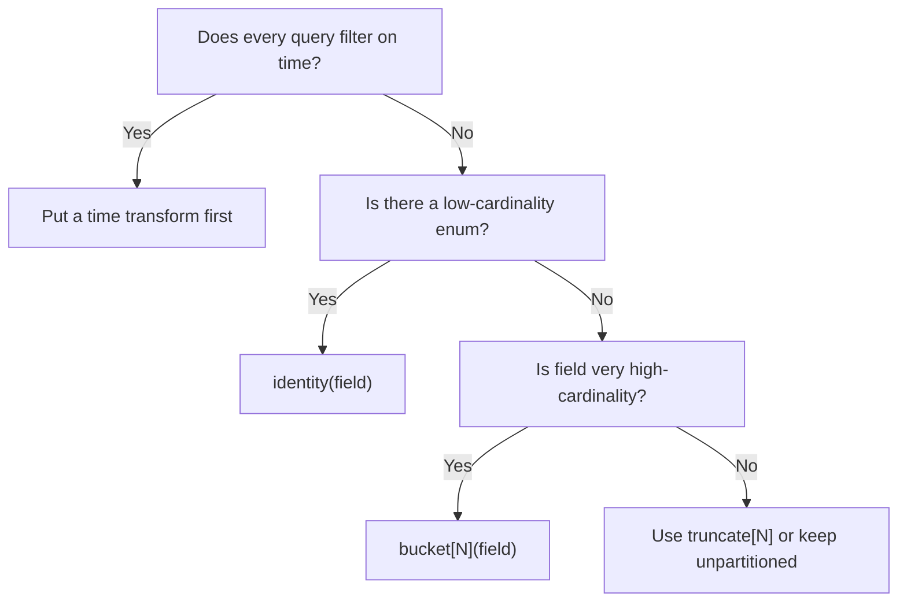

# Iceberg Partitioning Support


Partitioning groups rows that share common values **at write-time**, so that queries filtering on those values read only the relevant files. The result is **fewer data files scanned, less I/O, and faster queries**. 


### How Iceberg handles partitions   

Iceberg automatically stores the *derived* partition values for each row in table metadata.  
Because the physical layout is hidden, your SQL can stay simple (`WHERE date > …`); Iceberg prunes away files that cannot match.  


###  Partition spec syntax used by the writer   

In `streams.json` file, add values in the below format to `partition_regex` string that describes one or more partition fields in order:

```json
"partition_regex": "/{field_name, transform}/{next_field, transform}"
```

| Component      | Meaning                                                            |
|----------------|--------------------------------------------------------------------|
| `field_name`   | Column in the incoming record (`created_at`, `user_id`, etc.)      |
| `transform`    | Iceberg transform that converts the value.        |

> **Special case**  
> You may use `now()` as a pseudo-column that evaluates to the writer’s current timestamp (useful when your records lack a suitable time field).

####  Complete examples

```text
# Partition rows by calendar year of a timestamp:
 /{created_at, year}

# Partition by whole day:
 /{event_date, day}

# Two-level spec: customer id bucket then month of event time
 /{customer_id, bucket[32]}/{event_time, month}

# Daily partitions based on the writer clock
 /{now(), day}
```


### Supported transforms—what they do and what you’ll see on disk

| Transform & Syntax | Typical use-case | How the transform works | Spec snippet | **Example input → partition value** |
|--------------------|------------------|-------------------------|--------------|-------------------------------------|
| **`identity`** | Columns with only a few distinct values – e.g. `country`, `status` | Writes the **raw value** unchanged | `/{status, identity}` | `status = 'active'` → folder `status=active/` |
| **`year`** | Time-series data where queries slice whole years | Extracts the calendar year as an integer | `/{created_at, year}` | `created_at = 2025-04-24 15:42` → `year=2025/` |
| **`month`** | Monthly reporting, rollups, retention | Returns the month number (1-12) of the timestamp | `/{created_at, month}` | `created_at = 2025-04-24 15:42` → `month=4/` |
| **`day`** | Daily dashboards, 30-day TTL jobs | Returns the local calendar day (1-31) | `/{event_date, day}` | `event_date = 2025-04-24` → `day=24/` |
| **`hour`** | High-volume logs where analysts drill into single hours | Returns hour-of-day (0-23) | `/{event_time, hour}` | `event_time = 2025-04-24 15:42` → `hour=15/` |
| **`bucket[N]`** | Very high-cardinality keys (email, UUID) to distribute writes | Hashes the value and assigns it to **N** numbered buckets (0…N-1) | `/{user_id, bucket[64]}` | `user_id = 'f47ac10b...'` → `user_id_bucket=17/` *(one of 64)* |
| **`truncate[N]`** | Long strings where only the prefix matters (domains, URLs) | Keeps the first **N** UTF-8 characters | `/{domain, truncate[4]}` | `domain = 'example.com'` → `domain=exam/` |

> **Quick guide to data types**  
> * `identity` and `truncate[N]` keep string values as strings.  
> * `year`, `month`, `day`, `hour` and `bucket[N]` store **integers** under the hood (e.g. `month=4`, `bucket=17`).  
>   That makes partition pruning cheap and predictable.


###  What if a field is missing?   

If the incoming record lacks a declared partition column, the writer sets that partition value to `null`. Iceberg treats `null` like any other value, so the row is written successfully and queries can still skip non-matching files.


###  Putting it all together   

```json title="config/snippets/stream.json"
{
  "selected_streams": {
    "my_namespace": [
      {
        "stream_name": "my_stream",
        "partition_regex": "/{timestamp_col, day}/{region, identity}",
        "normalization": false,
        "append_only": false
      }
    ]
  }
}
```

Run your sync as usual; the writer produces an Iceberg table whose directories reflect the spec:

```
my_stream/
 └─ day=2025-04-14/
     └─ region=in/
         └─ data-file.parquet
```

####  Querying partitioned tables

```sql
-- Only partitions for 1 May 2023 and region 'us-east' are read
SELECT *
FROM olake_iceberg.olake_iceberg.my_stream
WHERE timestamp_col = DATE '2023-05-01'
  AND region = 'us-east';
```

Because Iceberg pushes the predicates (`timestamp_col`, `region`) down to the metadata layer, files outside those partitions are skipped entirely. 


## Partition-spec “cheat-sheet”  

All the examples below follow the **same four-block layout** so you can scan, copy, and adapt them quickly:

* **Partition Spec** – the exact string to paste into `partition_regex`  
* **Good For** – what kind of workload/problem it solves  
* **Why It Works** – the principle behind the layout  
* **Sample Folders & Query** – one real path and a SQL snippet to show pruning in action  


### 1  Streaming click-stream logs
**Partition Spec**

```text
/{event_time, hour}/{user_id, bucket[512]}
```

**Config**

```json
{
  "stream_name": "web_events",
  "partition_regex": "/{event_time, hour}/{user_id, bucket[512]}"
}
```

**Folder created**

```
event_time_hour=2025-04-24-15/user_id_bucket=344/part-00001.parquet
```

**Query that prunes**

```sql
SELECT count(*)
FROM   web.events
WHERE  event_time BETWEEN TIMESTAMP '2025-04-24 15:00'
                      AND TIMESTAMP '2025-04-24 15:59';
```


### 2  Global e-commerce orders
**Partition Spec**

```text
/{order_date, month}/{ship_country, identity}
```

**Config**

```json
{
  "stream_name": "orders",
  "partition_regex": "/{order_date, month}/{ship_country, identity}"
}
```

**Folder**

```
order_date_month=2025-04/ship_country=IN/part-00037.parquet
```

**Query**

```sql
SELECT sum(grand_total)
FROM   sales.orders
WHERE  order_date BETWEEN DATE '2025-04-01' AND DATE '2025-04-30'
  AND  ship_country = 'IN';
```


### 3  IoT device telemetry
**Partition Spec**

```text
/{event_date, month}/{device_id, bucket[64]}
```

**Config**

```json
{
  "stream_name": "telemetry",
  "partition_regex": "/{event_date, month}/{device_id, bucket[64]}"
}
```

**Folder**

```
event_date_month=2025-04/device_id_bucket=22/part-00003.parquet
```

**Query**

```sql
SELECT *
FROM   iot.telemetry
WHERE  device_id = 'sensor-9f2c'
  AND  event_date_month = '2025-04';
```


### 4  Modernising a Hive `yyyy/mm/dd` layout
**Partition Spec**

```text
/{order_ts, year}/{order_ts, month}/{order_ts, day}
```

**Config**

```json
{
  "stream_name": "hive_migrated_orders",
  "partition_regex": "/{order_ts, year}/{order_ts, month}/{order_ts, day}"
}
```

**Folder**

```
order_ts_year=2025/order_ts_month=04/order_ts_day=24/part-99983.parquet
```

**Query**

```sql
SELECT *
FROM   sales.orders
WHERE  order_ts = DATE '2025-04-24';
```


### 5  GDPR / CCPA expiry window (day-level)
**Partition Spec**

```text
/{delete_after, day}
```

**Config**

```json
{
  "stream_name": "regulated_events",
  "partition_regex": "/{delete_after, day}"
}
```

**Folder**

```
delete_after_day=2025-05-24/part-00017.parquet
```


### 6  Pure identity on low-cardinality code
**Partition Spec**

```text
/{status, identity}
```

**Config**

```json
{
  "stream_name": "user_status",
  "partition_regex": "/{status, identity}"
}
```

**Folder**

```
status=active/part-00009.parquet
```

**Query**

```sql
SELECT *
FROM   users.status
WHERE  status = 'active';
```


### 7  Hierarchical calendar (year → month → day)
**Partition Spec**

```text
/{event_ts, year}/{event_ts, month}/{event_ts, day}
```

**Config**

```json
{
  "stream_name": "event_log",
  "partition_regex": "/{event_ts, year}/{event_ts, month}/{event_ts, day}"
}
```

**Folder**

```
event_ts_year=2025/event_ts_month=04/event_ts_day=24/part-00571.parquet
```

**Query**

```sql
SELECT *
FROM   logs.events
WHERE  event_ts BETWEEN DATE '2025-04-24' AND DATE '2025-04-24';
```


### 8  Prefix truncate on long strings
**Partition Spec**

```text
/{domain, truncate[4]}
```

**Config**

```json
{
  "stream_name": "web_domains",
  "partition_regex": "/{domain, truncate[4]}"
}
```

**Folder**

```
domain=exam/part-00001.parquet          # holds rows like 'example.com'
```

**Query**

```sql
SELECT *
FROM   web.domains
WHERE  domain LIKE 'exam%';
```


### 9  Boolean flag shield
**Partition Spec**

```text
/{is_test, identity}
```

**Config**

```json
{
  "stream_name": "mixed_traffic",
  "partition_regex": "/{is_test, identity}"
}
```

**Folder**

```
is_test=true/part-00005.parquet
```

**Query**

```sql
SELECT *
FROM   prod.events
WHERE  is_test = false;   -- skips the whole test partition
```


### 10  Schema-versioned blobs
**Partition Spec**

```text
/{schema_version, identity}/{update_ts, month}
```

**Config**

```json
{
  "stream_name": "json_blobs",
  "partition_regex": "/{schema_version, identity}/{update_ts, month}"
}
```

**Folder**

```
schema_version=v3/update_ts_month=2025-04/part-00077.parquet
```

**Query**

```sql
SELECT payload->>'new_field'
FROM   repo.blobs
WHERE  schema_version >= 'v3';
```

### Quick-select flowchart  



> **Rule of thumb** – Aim for **100 - 10 000 small files** inside each partition folder.  
> Adjust bucket counts or combine fields until you hit that sweet spot.


Use these patterns as a baseline, evolve when your query patterns or data volume change, and you’ll keep scans fast without over-engineering your layout.


### Checklist before you decide

| Question | If **yes**, consider … |
|----------|-----------------------|
| Do most queries filter on a date range? | Put a time transform first (`day`, `month`). |
| Is one field extremely high-cardinality? | Add `bucket[N]`. |
| Do you need easy bulk-deletes? | Partition on expiry or ingest date. |
| Do analysts group by a specific code (country, status)? | Use `identity` on that column. |

Stick to one or two partition fields at first; you can *evolve* later if query patterns change.  

### Quick checklist before you pick a spec

1. **Cardinality** — Aim for 100 – 10 000 files per partition folder.  
2. **Skew** — Use `bucket[N]` when one value dominates (e.g., a single large tenant).  
3. **Time range queries** — Put the *time transform first* if nearly every query filters on a date.  
4. **Evolution** — Start simple (e.g., `{event_date, day}`) and add more fields later; Iceberg keeps old snapshots readable.

These patterns should cover 90 % of use-cases we’ve seen in the field.  
If your workload looks different, open an issue or drop us a message—we love weird corner-cases!


###  Further reading

- [What is Iceberg Partitioning? (official docs)](https://iceberg.apache.org/docs/latest/partitioning/#what-is-partitioning)
- [What is transform (official docs)](https://iceberg.apache.org/spec/#partitioning)


### Need more help?   

If any part of this guide feels unclear, open an issue in the docs repo or ping us on Slack—feedback helps us improve!